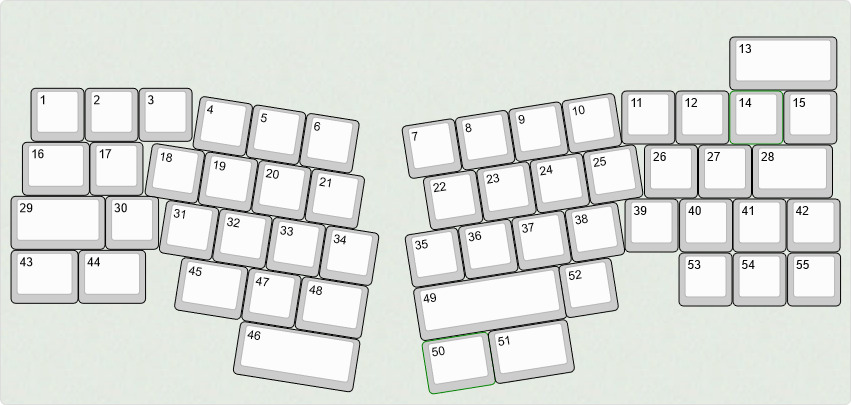

# Cheshire 50 - WIP!!!
#### 50% Alice / Arisu style keyboard

---

**DISCLAIMER: This is my first keyboard design, so things might be a little odd**

# Features
 - Gasket Mount
 - Daughterboard with USB-C
 - Arrow Cluster
 - optional Split Spacebars
 - optional Split Backspace
 - up to 52 keys
 - Open Source (duh)

